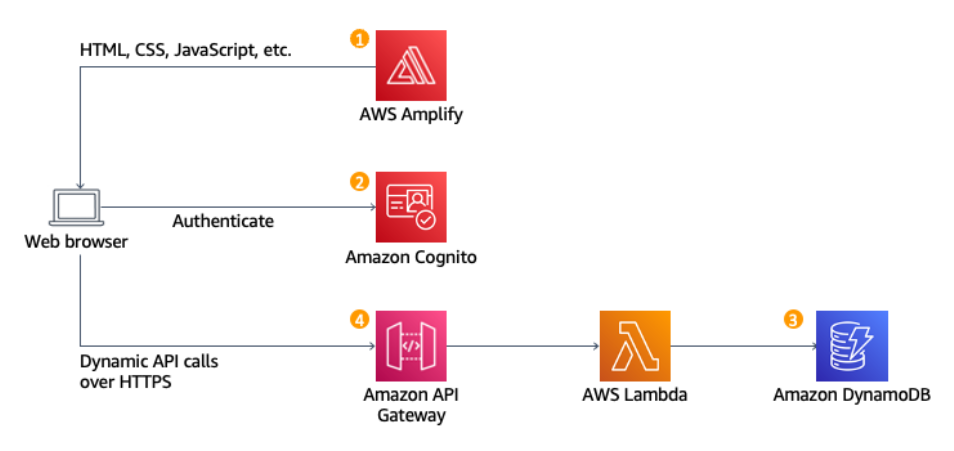

# Build a Serverless Web Application
## Overview
In this tutorial, you will create a simple serverless web application that enables users to request unicorn rides from the Wild Rydes fleet. The application will present users with an HTML-based user interface for indicating the location where they would like to be picked up and will interact with a RESTful web service on the backend to submit the request and dispatch a nearby unicorn. The application will also provide facilities for users to register with the service and log in before requesting rides.
## Prerequisites
To complete this tutorial, you will need an AWS account, an account with ArcGIS to add mapping to your app, a text editor, and a web browser. If you don't already have an AWS account, you can follow the Setting Up Your AWS Environment getting started guide for a quick overview.
## Application architecture
The application architecture uses AWS Lambda, Amazon API Gateway, Amazon DynamoDB, Amazon Cognito, and AWS Amplify Console. Amplify Console provides continuous deployment and hosting of the static web resources including HTML, CSS, JavaScript, and image files which are loaded in the user's browser. JavaScript executed in the browser sends and receives data from a public backend API built using Lambda and API Gateway. Amazon Cognito provides user management and authentication functions to secure the backend API. Finally, DynamoDB provides a persistence layer where data can be stored by the API's Lambda function.

### Static Web Hosting
AWS Amplify hosts static web resources including HTML, CSS, JavaScript, and image files which are loaded in the user's browser.
### User Management
Amazon Cognito provides user management and authentication functions to secure the backend API.
### Serverless Backend
Amazon DynamoDB provides a persistence layer where data can be stored by the API's Lambda function.
### RESTful API
JavaScript executed in the browser sends and receives data from a public backend API built using Lambda and API Gateway.
## Modules
This tutorial is divided into five modules. Each module describes a scenario of what we're going to build and step-by-step directions to help you implement the architecture and verify your work.
- Host a Static Website (15 minutes): Configure AWS Amplify to host the static resources for your web application with continuous deployment built in 
- Manage Users (30 minutes): Create an Amazon Cognito user pool to manage your users' accounts
- Build a Serverless Backend (30 minutes): Build a backend process for handling requests for your web application
- Deploy a RESTful API (15 minutes): Use Amazon API Gateway to expose the Lambda function you built in the previous module as a RESTful API
- Terminate Resources (10 minutes): Terminate all the resources you created throughout this tutorial
### Static Web Hosting with Continuous Deployment
In this module, you will configure AWS Amplify to host the static resources for your web application with continuous deployment built in. The Amplify Console provides a git-based workflow for continuous deployment and hosting of full-stack web apps. In subsequent modules, you will add dynamic functionality to these pages using JavaScript to call remote RESTful APIs built with AWS Lambda and Amazon API Gateway. The architecture for this module is straightforward. All of your static web content including HTML, CSS, JavaScript, images, and other files will be managed by AWS Amplify Console. Your end users will then access your site using the public website URL exposed by AWS Amplify Console. You don't need to run any web servers or use other services to make your site available. For most real applications you'll want to use a custom domain to host your site. If you're interested in using your own domain, follow the instructions for setting up a custom domain on Amplify.
### Implementation
- Select a region
- Create a Git repository
- Populate the Git repository
Change directory into your repository and copy the static files from S3:
```
aws s3 cp s3://wildrydes-us-east-1/WebApplication/1_StaticWebHosting/website ./ --recursive
```
Commit the files to your Git service
```
git add .
git commit -m 'new'
git push
```
- Enable Web Hosting with the AWS Amplify Console
- Modify your site
- Recapx